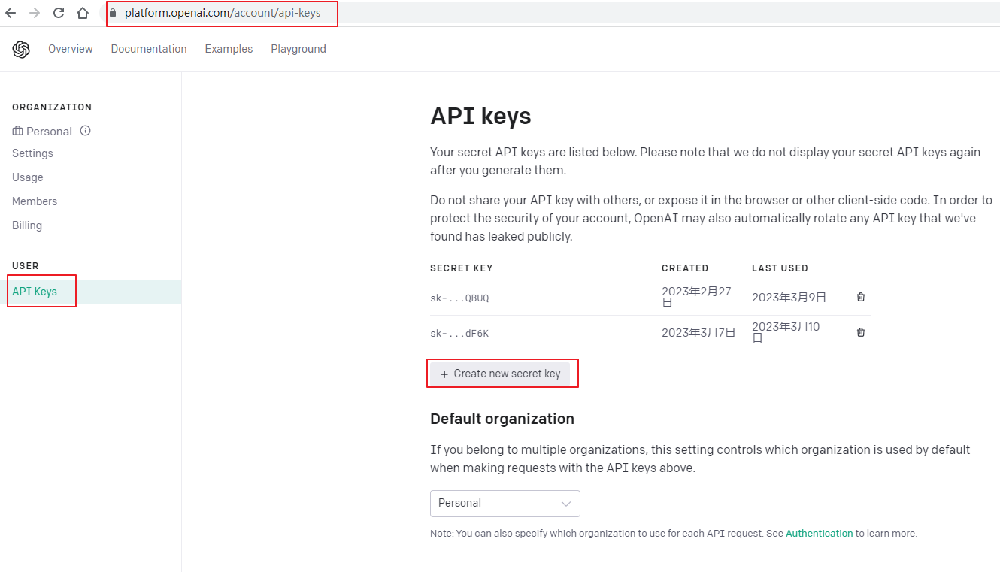
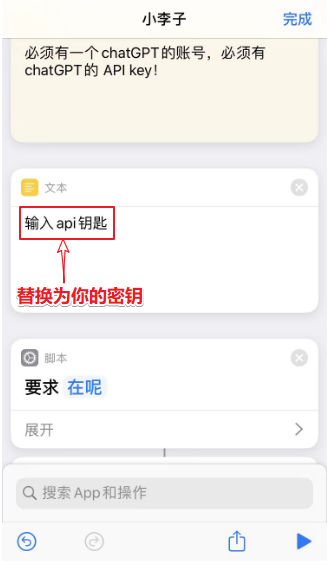

# ChaGPT集成在手机使用

## 效果演示
### 1.代替Siri
 
### 2.代替搜索引擎
	
## 1.在OpenAI官网注册账号
### 准备工具
1. 梯子翻墙 
2. 国外手机虚拟号码 
3. 进入openai.com官方网址注册；用购买的国外虚拟号码接收注册短信验证码完成注册；
## 2.创建ChatGPT的API密钥
1. 进入https://platform.openai.com/account/api-keys创建API密钥；
2. 保存好，后续会将密钥粘贴到快捷指令脚本里。

## 3.苹果手机导入“快捷指令”应用的脚本，并修改；
1. 苹果手机默认浏览器打开下方脚本链接地址安装脚本；
2. 脚本地址： https://www.icloud.com/shortcuts/1364e7e1f7874586a7cd5154f3c15820
3. 在脚本中替换为你刚保存的API密钥；

## 4.运行快捷指令
点击运行快捷指令可以用于搜索，或用siri呼唤快捷指令名称运行；不懂可以关注《Python利剑》咨询；

